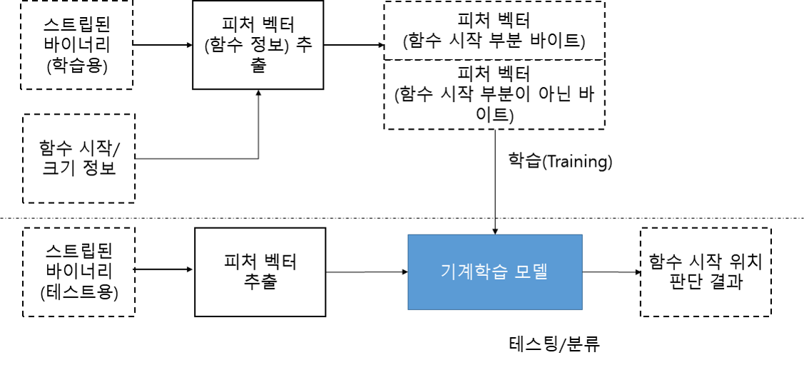
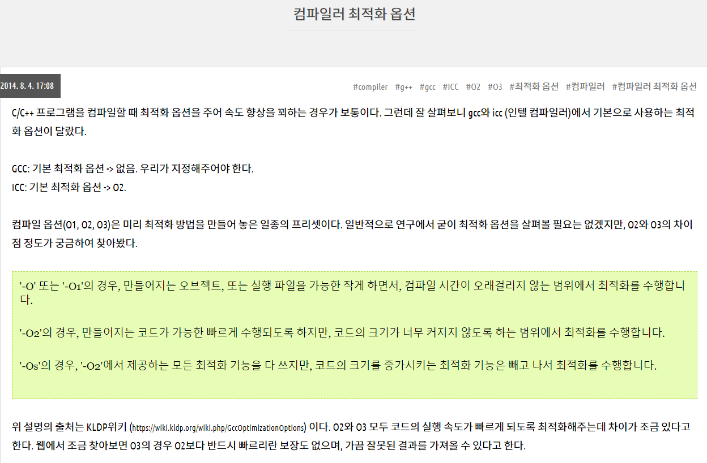
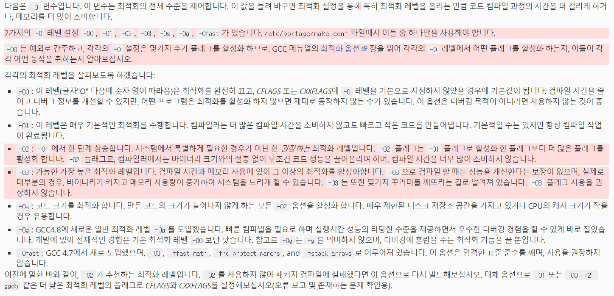

### 국가보안기술연구소(NSR) Project

## ■ 바이너리 대상 컴파일러 및 함수정보 추출 기계학습 기술 연구

### ■ 연구 필요성
- 다양한 바이너리 분석 도구
  - BAP, BitBlaze, BinNavi, IDA Pro 등
  - 스트립(stripped) 바이너리 분석 정확도 낮음

- 리눅스용 다양한 컴파일러 
  - gcc 7.2, 8.0, 8.3, 9.0 …

- 스트립 바이너리 분석 어려움
  - 디버그 심볼이 없음 -> 역공학 어려움
  - 컴파일러 종류/버전/최적화 정도 파악 어려움
  - 함수 위치 파악 어려움

- 스트립 악성 코드 분석을 위한 스트립 바이너리 분석 기술 필요

### ■ 연구개발 목표
- 기계학습 기반의 스트립(stripped) 리눅스 바이너리 분석 기술
  - 스트립 바이너리 제작에 사용된 컴파일러 탐지 기술
    - 바이너리 대상 컴파일러 종류 및 버전 판별 기계학습 모델
  - 스트립 바이너리에서 함수 위치 탐지 기술
    - 함수 위치정보 (시작, 종료) 추출 기계학습 모델 연구
    - 함수 Basic block 정보 추출 기술 연구

### ■ 연구 내용 3 - 함수 정보 추출
- 스트립된 리눅스 바이너리에서 함수정보 추출 기술 연구
  - 함수 위치정보 (시작, 종료) 추출 기계학습 모델 연구
  - 스트립된 바이너리에서, K개의 함수 시작 주소와 크기를 추출하는 기계학습 모델 설계
    

## 진행상황 (연구내용 3)

### 1. 자료조사 및 관련 논문 리뷰 (20.04.15) 
    - 문서 : 논문 : Recognizing functions in binaries with neural networks_augsut 2015 (USENIX)
    - 문서 : 1차 정리 파일 document/(20.04.15)김선민 Recognizing Functions in Binaries with Neural Networks 요약본

### 2. Bidirectional RNN 구현 (1) 및 Stripped Binary 관련 공부 (20.05.08)
    - 문서 : (20.05.08) Recognizing Functions in Binaries with Neural Networks 구현 (논문 부분적 내용 정리)
    - 문서 : (20.05.08) 김선민,장두혁 Bidirectional RNN 구현 및 Stripped Binary 공부
        - 소스코드 : Preprocessing/Preprocessing_Save_hexByteCode.ipynb

### 3. BIRNN 구현 (2)  (20.06.05)
    - 문서 : (20.06.05) BIRNN 구현
    - BIRNN 구현 시도 -> Imbalanced Data 문제 발생
    - Imbalanced Data 문제 해결 방법으로 -> 함수 시작 주변 N byte 자르는 방식생각 
        - 소스코드 : RNN_by_All_Binary/BiRNN_gcc5_op0~2_by_All_Binary.ipynb

 

### 4. Imbalanced Data에 대한 솔루션 (20.06.23)
    - 문서 : (20.06.23) Imbalanced Data에 대한 Solution -> 함수 시작(1) 주변 N byte 자르는 방식 생각
    - 논문 내용 따라 10-fold Cross Validation 진행 (RNN의 Sequential 한 특징 때문에 수동 교차검증? 진행)
    - 다양한 N-Byte 기준 실험 진행
    - 10 N-Byte 기준 함수의 시작 주변 양쪽이 아닌 시작기준 뒤쪽만 하는것도 구상

        - 소스코드 : Passive_CrossValidation/수동교차검증_gcc4_3gram, 10gram, 20gram, 30gram
        - 소스코드 : Sub_Chunk_Test (전체 데이터 중 일부 1000byte씩 뽑아서 실험)
        - 소스코드 : NByte_gram_Test (다양한 gcc, 최적화 옵션 따라서 10byte 실험 진행)

 

### 5. N Byte gram Solution (20.07.07)
    - 문서 : (20.07.07)함수시작구분RNN
    - 함수시작정보 부분만 잘라서 사용하는 NByte 방식과
    - 함수시작정보 포함데이터 + 미포함 데이터 5:5 비율 실험결과
        - 소스코드 : RNN_Input_Ngram_함수정보포함데이터만
        - 소스코드 : RNN_Input_Ngram_함수정보미포함데이터추가
        

### 6. N byte 방식 다양한 하이퍼 파라미터로 실험 및 결과 공유 (20.07.22)
    - 문서 : (20.07.22)바이너리 대상 컴파일러 및 함수정보 추출 기계학습 기술 연구(장두혁,김선민)
    - 실험결과 파일 : (20.07.22)국보연 실험(binutils).xlsx, (20.07.25)국보연 실험결과(coreutils).xlsx
    - N Byte 방식 다양한 하이퍼 파라미터로 실험 진행 -> 90% 결과 도달
    - N Byte 방식 GCC6 최적화 O0 ~ O3의 실험 진행 및 결과
      - 소스코드 : 함수시작정보포함데이터 & 정보미포함데이터_GCC6 이하 폴더들 

 

### 7. 최종 실험 결과 
    - 문서 : (20.07.29)국보연 GCC6 결과최종
    - 실험결과 파일 : (20.07.27)국보연 실험결과(binutils&coreutils).xlsx
    - GCC 6 바이트추출시 CODE 부분만 데이터 재수집
    - N Byte 방식 , 전체 데이터 활용 방식 99% 결과 도달
      - 소스코드 : binutils&coreutils_GCC6_최종

### 8. 최종 결과 반영 프로그램 만들기
    - 실험결과 파일 : prediction 폴더 산하 파일들
    - 현재 실험 결과 모델 저장 및 모델 내장 후 자동 추론 프로그램 만들기
    
### 9. 지속적 보완
    - 이전 KFold 학습데이터 : 각 실행파일 중 코드섹션의 함수 부분만 학습 -> 전체 섹션에 대한 모든 함수 부분 학습
    - 소스코드 : Prediction2/bin_core_gcc6_op0_Input Sequence 32_hidden units 48x2 ~ o3

